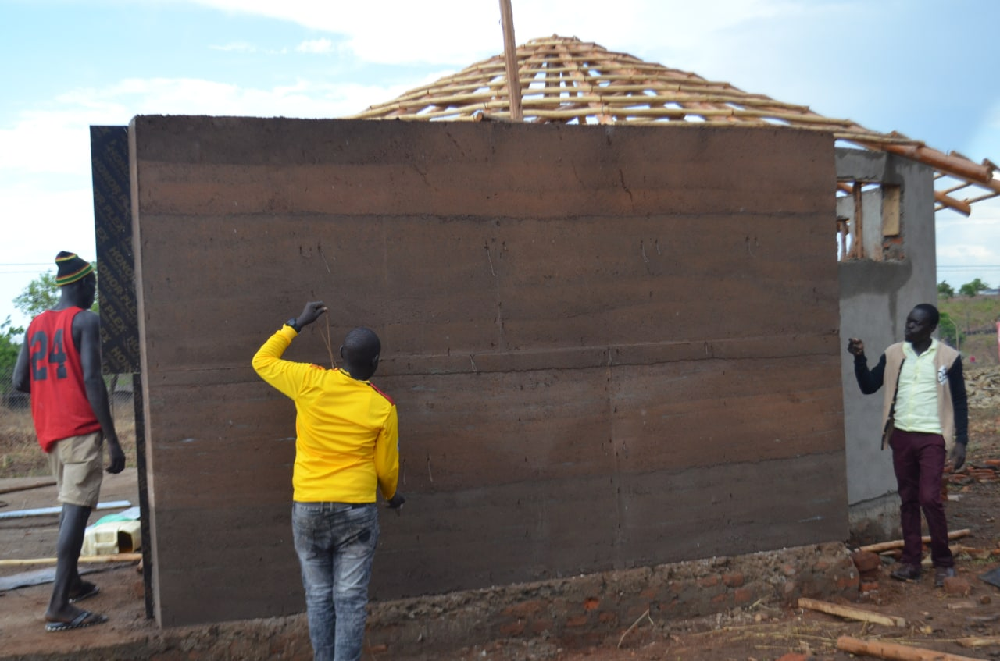
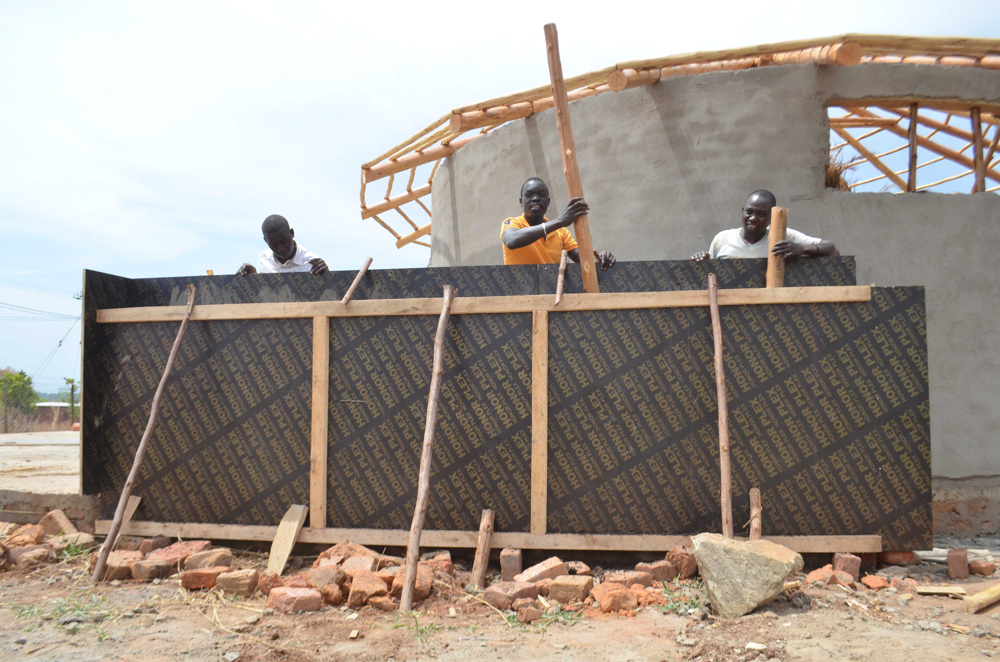
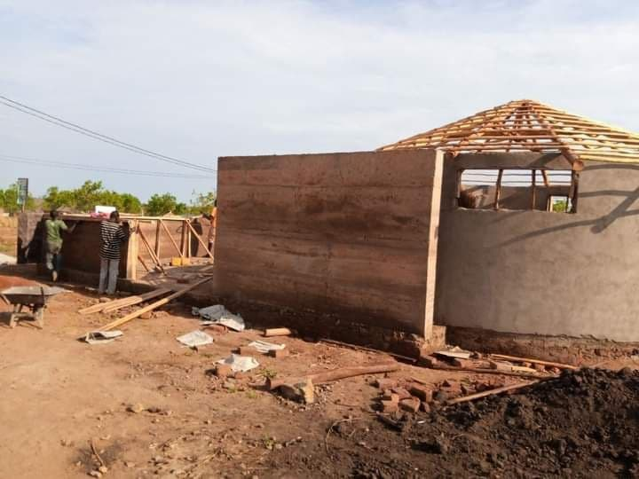
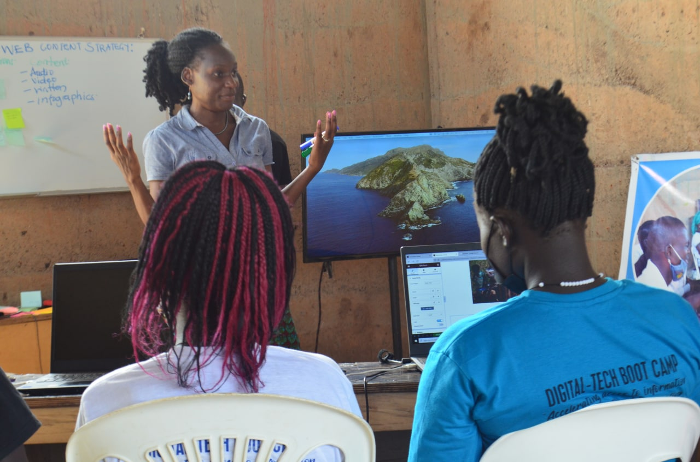
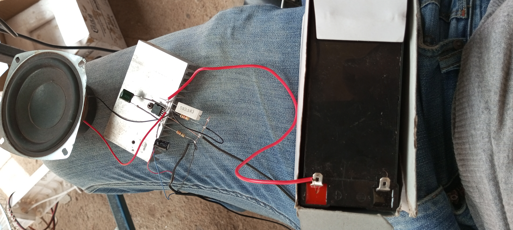
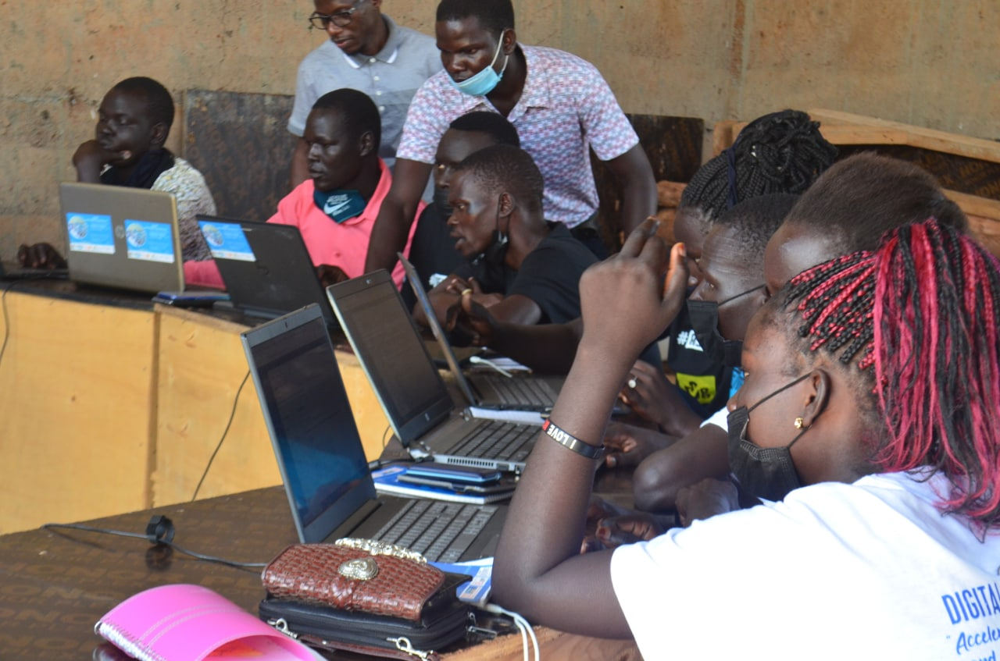
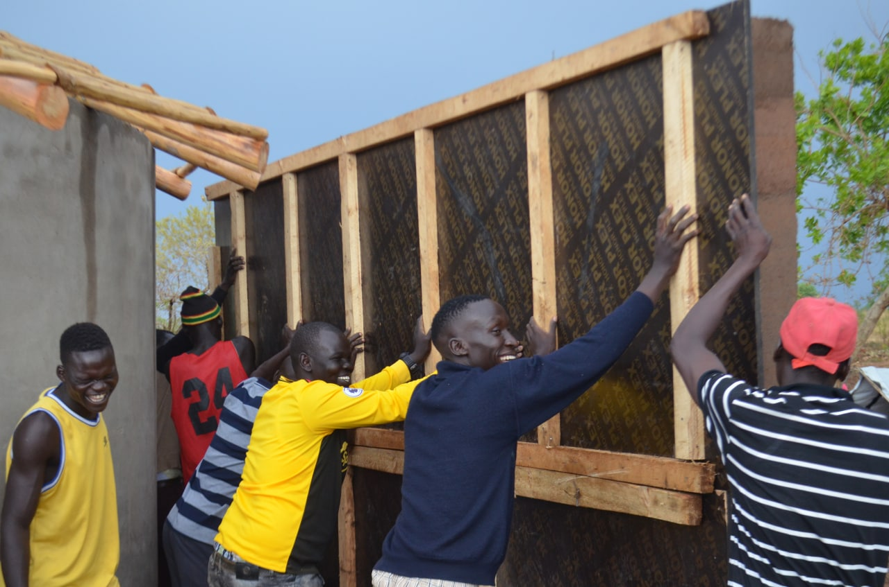
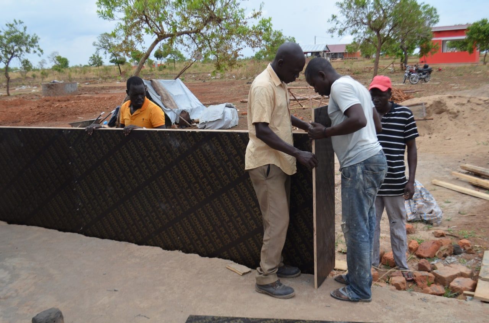
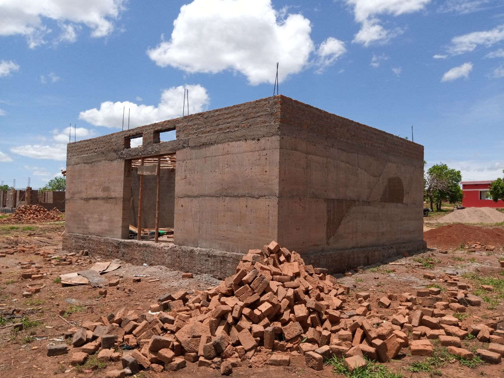

# pagirinya-satelite-house-prototype
Pagirinya satelite house prototype is a sustainable ICT enhanced social network work space(SNS) aligned with The Youth Empowerment Foundation (YEF) adjumani

# target
- Bringing all the Youths from different ethnic affiliation in pagirinya and neighbouring south sudan refugee settlements and host communities in Uganda together.

# how?
- Engaging in open tech innovation,peace building,media and information literacy(MIL),career inspiration and life skills

# aims
- To strengthen the activities of The Youth Empowerment Foundation (YEF)in the region for a collective,social, mobilisation as a strategy for empowering the youth to embrace the active participation in peace,non violence and reconciliation dialogues.

**The Youths are actively participating in the construction of the satelite house prototype**

In order to overcome

*The past ethnic prejudice or stereotypes*
*Cultural rigidity/nostalgia*
*Political differences*
*Economic depression* etc
- A network of trainings via the satelite is to be established and existing projects to connect the satelite and the youths will be accelerated

# mission
- To organise and conduct regular training and free space for young innovatories in the settlement.
# vision;
- To act as a modal institution and resource center of excellence in technology and open source research.
- To develop an ICT and youth led skill enhanced social network space(SNS)for effective peace, education,mobility and Empowerment of the youths in south sudanese refugee settlement and the host communities.

 
